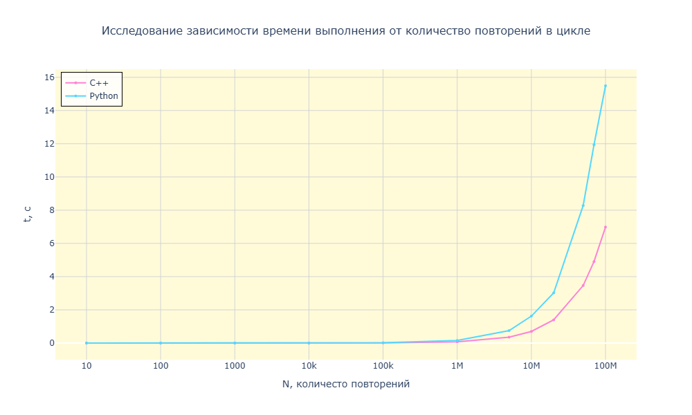

Лабораторная работа №2 

Цель: Познакомится с принципами комплиции исходного кода. Составить программу с использованием циклов, условий и функций. Сравнить быстродействие между C++ и Python. Ознакомление с типами данных 


Результат работы кода на C++

```console
Enter number of iterations (or non-number to exit): 10
Time taken: 0 seconds
Run again? (y/n): y
Enter number of iterations (or non-number to exit): 100
Time taken: 0 seconds
Run again? (y/n): y
Enter number of iterations (or non-number to exit): 1000
Time taken: 0 seconds
Run again? (y/n): y
Enter number of iterations (or non-number to exit): 10000
Time taken: 0.001 seconds
Run again? (y/n): y
Enter number of iterations (or non-number to exit): 100000
Time taken: 0.008 seconds
Run again? (y/n): y
Enter number of iterations (or non-number to exit): 1000000
Time taken: 0.074 seconds
Run again? (y/n): y
Enter number of iterations (or non-number to exit): 10000000
Time taken: 0.7 seconds
Run again? (y/n): y
Enter number of iterations (or non-number to exit): 100000000
Time taken: 6.98 seconds
Run again? (y/n): n
```

Результаты работы кода на python

```console
Enter number of iterations (or non-number to exit): 10
Time taken: 0.000023 seconds
Run again? (y/n): y
Enter number of iterations (or non-number to exit): 100
Time taken: 0.000020 seconds
Run again? (y/n): y
Enter number of iterations (or non-number to exit): 1000
Time taken: 0.000222 seconds
Run again? (y/n): y
Enter number of iterations (or non-number to exit): 10000
Time taken: 0.001524 seconds
Run again? (y/n): y
Enter number of iterations (or non-number to exit): 100000
Time taken: 0.016313 seconds
Run again? (y/n): y
Enter number of iterations (or non-number to exit): 1000000
Time taken: 0.154199 seconds
Run again? (y/n): y 
Enter number of iterations (or non-number to exit): 10000000
Time taken: 1.621309 seconds
Run again? (y/n): y  
Enter number of iterations (or non-number to exit): 100000000
Time taken: 15.489819 seconds
Run again? (y/n): y
Enter number of iterations (or non-number to exit): 1000000000
Time taken: 160.958323 seconds
Run again? (y/n): n 
```

Строим график (при построении были добавлены еще точки для наглядности) 



Вывод: 

C++ ожидаемо превосходит Python в вычислительно-нагруженных задачах благодаря комплиции в машинный код и отсутствию накладных расходов интерпретатора.
